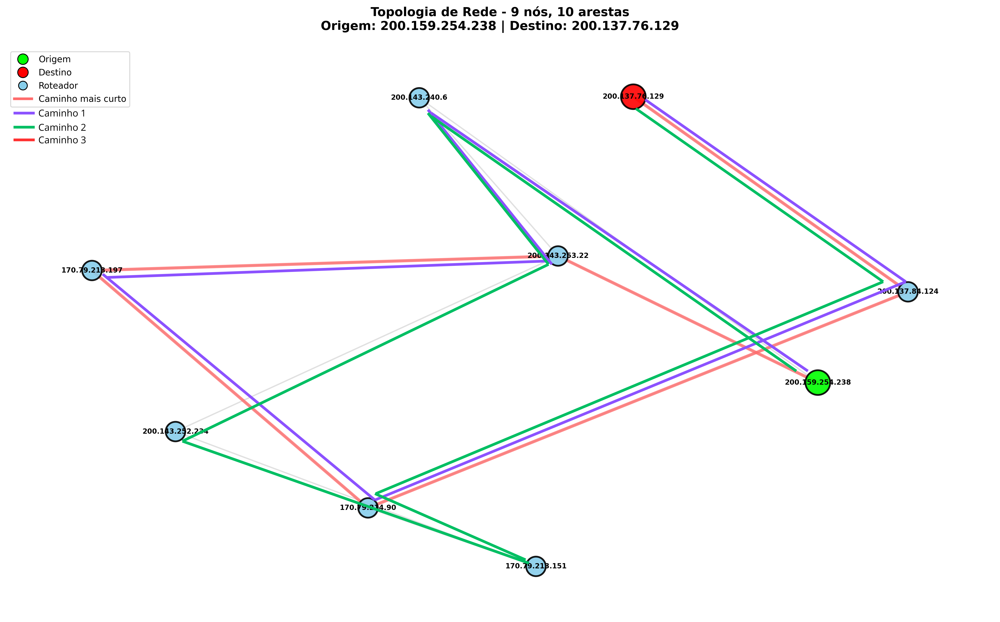

# O Problema

O tráfego na internet é diverso, e cada tipo de fluxo possui demandas e requisitos diferentes. O estudo em redes cientes de caminho busca encontrar estratégias para que as aplicações sejam capazes de escolher ou influenciar a escolha do caminho para seus fluxos de dados. Para isso, é preciso que as camadas de rede e transporte forneçam informações explícitas sobre os caminhos disponíveis para os endpoints e suas aplicações.

Uma forma de alcançar esse objetivo é coletando e disponibilizando dados de telemetria da rede. Por representarem o estado da rede de forma realista, séries históricas de métricas como latência e largura de banda podem ser utilizadas para tomadas de decisão de engenharia de tráfego.


<p align='justify'> Na topologia ilustrada na figura, há conectividade redundante entre os nós, o que possibilita múltiplas rotas entre uma origem e um destino. Por exemplo, um host conectado ao nó S1 pode alcançar um host conectado ao nó S6 por quatro caminhos distintos, cada um com características próprias de latência, largura de banda, estabilidade, etc. Em cenários reais, essas métricas variam ao longo do tempo devido ao congestionamento e às condições dinâmicas da rede. Nesse contexto, surge o problema central deste trabalho: diante de múltiplas rotas possíveis e conhecendo-se a telemetria histórica de cada uma, como determinar automaticamente o melhor caminho para um novo fluxo de rede? </p>

Esse trabalho propõe investigar se, a partir de séries históricas de telemetria dos caminhos em uma topologia, é possível utilizar algoritmos de inteligência artificial (IA) para selecionar a melhor rota para novos fluxos de rede.

# Materiais e métodos

Para avançar na investigação do problema, adotamos inicialmente um cenário reduzido e controlado. Em vez de considerar múltiplas métricas de rede simultaneamente, optamos por analisar apenas uma métrica por vez em uma topologia simples com caminhos redundantes. Essa abordagem reduz a complexidade e permite comparar o desempenho de diferentes algoritmos na seleção da melhor rota. Neste estágio inicial, utilizamos a latência como critério de decisão, assumindo que o melhor caminho é aquele com menor atraso fim a fim. Além disso, buscamos trabalhar com dados reais de rede, de forma a refletir condições práticas de variação de tráfego e estado da rede.

A tarefa de seleção de rota é formulada como um problema de comparação entre caminhos ao longo do tempo. Para cada instante 𝑡 (timestamp), comparamos os valores de uma mesma métrica coletada em todos os caminhos disponíveis. Com base nesses valores, o algoritmo deve escolher o caminho considerado mais adequado segundo o critério definido (por exemplo, menor latência). A saída do modelo é um identificador de caminho (pathId), representado por um inteiro que varia de 1 a 𝑁, onde 𝑁 é o número total de rotas possíveis na topologia. A estrutura dos dados de entrada é organizada da seguinte forma:

```
[
    ( timestamp_0, metrica_caminho1, metrica_caminho2, ..., metrica_caminhoN ),
    ...,
    ( timestamp_N, metrica_caminho1, metrica_caminho2, ..., metrica_caminhoN )
]

# saída esperada por timestamp:
--> pathId
```

## Descrição do Dataset

Como primeiro passo, investigamos o uso do dataset disponibilizado pela Rede Nacional de Ensino e Pesquisa (RNP), coletado em 2024 em um subconjunto de nós da rede Ipê. O dataset possui diversas séries históricas de medições de traceroute, onde cada amostra registra os valores de RTT (Round Trip Time) em cada salto do caminho entre dois pontos da rede em um dado instante de tempo. Além disso, também fornece histogramas de RTT em um determinado timestamp aproximado. A seguir, um exemplo de leitura extraída do dataset, correspondente a um traceroute entre nós localizados no Rio de Janeiro e Espírito Santo, em um determinado timestamp, e o primeiro histograma para o mesmo par:

```
# Leitura de traceroute RJ-ES
[
    {
        "ts": 1718359167,
        "val": [
            {
                "ttl": 1,
                "ip": "200.137.76.129",
                "hostname": "gateway",
                "rtt": 2.1
            },
            {
                "ttl": 2,
                "ip": "200.137.84.124",
                "rtt": 1.5
            },
            {
                "ttl": 3,
                "ip": "170.79.214.90",
                "rtt": 1.6
            },
            {
                "ttl": 4,
                "ip": "170.79.213.197",
                "hostname": "crj1-ces1-100g-telebras.bkb.rnp.br",
                "rtt": 8.3
            },
            {
                "ttl": 5,
                "ip": "200.143.253.22",
                "hostname": "lanrj-rj.bkb.rnp.br",
                "rtt": 8.5
            },
            {
                "ttl": 6,
            },
            {
                "ttl": 7,
                "ip": "200.159.254.238",
                "hostname": "monipe-rj-atraso.rnp.br",
                "rtt": 8.5
            }
        ]
    }
]
```

```
# Histograma RTT entre RJ-ES
[
    {
        "ts": 1717718499,
        "val": {
            "7.00": 3,
            "6.99": 2,
            "7.01": 1,
            "7.05": 1,
            "6.97": 1,
            "6.95": 1,
            "7.49": 1
        }
    },
    ...
]
```

Por apresentar uma subtopologia com menos nós e caminhos medidos, iniciamos pela avaliação dos dados fornecidos entre Rio de Janeiro e Espírito Santo.

## Limitações

1. **Dados coletados em uma rede que não é ciente de caminhos**

    A rede utilizada para a coleta dos dados não possui mecanismos explícitos de seleção ou divulgação de caminhos, ou seja, não é uma rede ciente de caminhos. Embora seja possível reconstruir os trajetos a partir das medições de traceroute, não há garantia de que os pacotes utilizados para medir o RTT percorreram exatamente os mesmos enlaces identificados pelo traceroute no momento da medição. Em redes IP tradicionais, o roteamento é dinâmico e pode variar devido a políticas internas, balanceamento de carga ou falhas temporárias, sem necessariamente haver registro dessas mudanças.

    Além disso, o dataset não fornece informações sobre os critérios de seleção de rotas utilizados pela rede subjacente. Dessa forma, não é possível afirmar com precisão se a sequência de saltos observada representa um caminho estável ou apenas uma rota momentânea. Essa incerteza dificulta a comparação com algoritmos de seleção de rotas baseados em IA.

2. **Dados dos caminhos coletados em timestamps diferentes**

    Como a tarefa proposta envolve comparar múltiplos caminhos entre dois pontos da rede, é essencial que as medições sejam analisadas em uma mesma base temporal, ou seja, em instantes de tempo iguais ou suficientemente próximos. Isso permite interpretar corretamente o estado da rede naquele momento e avaliar o desempenho relativo entre os caminhos. No entanto, no dataset analisado, as medições de traceroute de diferentes rotas entre a mesma origem e destino foram coletadas em timestamps distintos, muitas vezes com grandes intervalos de tempo entre elas.

    Além disso, a troca de rota é incomum, e acontece após longos períodos de tempo - até dias. Como consequência, comparar os caminhos no tempo torna-se um desafio, pois as séries históricas não estão temporalmente alinhadas. Essa defasagem temporal exige etapas adicionais de sincronização e interpolação, que podem introduzir distorções nas comparações e comprometer a fidelidade da análise.

3. **Dados coletados com frequência irregular**

    A coleta das medições ao longo do tempo não segue um intervalo fixo entre amostras, resultando em séries temporais com espaçamentos irregulares. Em diversos casos, observam-se medições separadas por apenas 5 ou 7 minutos, enquanto outros intervalos chegam a 49 minutos, horas ou até dias sem registros. Essa irregularidade é prejudicial porque impede a análise temporal consistente da métrica de latência, dificultando tanto a comparação entre caminhos quanto a identificação de padrões de comportamento da rede. Além disso, muitos algoritmos de aprendizado de máquina e métodos estatísticos para séries temporais pressupõem dados uniformemente espaçados no tempo. Assim, a irregularidade na frequência de coleta exige etapas adicionais de pré-processamento, como reamostragem e interpolação, que podem introduzir vieses nos dados e afetar adversamente a qualidade do modelo preditivo.

4. **Desbalanceamento de amostras dos caminhos**

    Apesar de fornecer uma grande quantidade de medidas ao longo do tempo, 1326 para o cenário de medição entre Rio de Janeiro e São Paulo, existe uma grande discrepância entre a quantidade medida de cada caminho. Aproximadamente 88% das amostras de traceroute representam apenas um caminho. Esse desbalanceamento sugere que, na prática, a rede adota um caminho predominante e raramente alterna para rotas alternativas.

    Esse cenário é problemático por diversas razões. Em primeiro lugar, a escassez de dados para os caminhos menos utilizados dificulta a caracterização do comportamento temporal desses trajetos, reduzindo a confiabilidade de qualquer tentativa de modelagem baseada neles. Em segundo lugar, do ponto de vista de aprendizado de máquina, o dataset torna-se severamente desbalanceado, favorecendo previsões que reproduzem o comportamento do caminho dominante. Isso pode levar modelos supervisionados a aprenderem um viés trivial — como prever sempre o caminho mais frequente — resultando em métricas artificialmente altas, mas sem capacidade real de generalização.

    Além disso, esse desbalanceamento é agravado pelo fato de que o caminho dominante apresenta também a menor latência em 97% dos casos (após o processo de interpolação). Assim, a tarefa de seleção de rotas torna-se degenerada: a ausência de diversidade nos exemplos limita a capacidade do modelo de distinguir situações em que uma rota alternativa poderia ser mais adequada. Em última instância, o desbalanceamento compromete tanto a variabilidade quanto o valor informativo do dataset, reduzindo sua utilidade para treinar e avaliar algoritmos que dependem de múltiplas escolhas possíveis de caminhos.

## Premissas e aproximações

## Pré-processamento

Inicialmente, foi necessário reconstruir a topologia entre Rio de Janeiro e Espírito Santo utilizando as medições de traceroute. Como algumas amostras apresentavam saltos incompletos ou sem resposta (como no exemplo anterior), adotamos a estratégia de ignorar esses hops ausentes e conectar diretamente o salto anterior ao seguinte, preservando a continuidade lógica do caminho observado. A Figura 2 apresenta a topologia resultante desse processo de reconstrução.


Uma limitação importante do dataset é que, para cada timestamp, ele disponibiliza apenas um caminho observado entre a origem e o destino. Além disso, como o RTT é medido a cada salto, não temos disponível o caminho de retorno desses pacotes. Por isso, não é possível decompor com precisão a latência por enlace individual para inferir as latências de caminhos alternativos no mesmo instante de tempo. 

Diante disso, para o caminho medido no timestamp, adotamos como latência do caminho o RTT do último nó alcançado, que representa o atraso acumulado fim a fim. No entanto, é importante ressaltar que essa pode ser uma estimativa aproximada, já que não há garantia de que a rota de retorno seja idêntica à de ida. Para os caminhos alternativos, decidimos seguir pela estratégia de interpolação temporal para inferir a latência no timestamp ausente.

Após extração e organização dos dados, construímos uma tabela contendo, para cada timestamp, a latência medida para cada caminho identificado. Os valores ausentes para caminhos que não foram observados naquele timestamp foram registrados como NaN. Posteriormente, utilizamos o método interpolate do pacote pandas no python. Fizemos um processo de interpolação linear em ambas as direções. O resultado da interpolação foi bastante coerente com os dados já obtidos. 

No entanto, é preciso ressaltar que as coletas para os caminhos dessa subtopologia estão desbalanceadas: o caminho 1 possui 1170 medições; o caminho 2, 155 medições; e o caminho 3, apenas uma medição. A Figura 3 destaca os caminhos medidos. Os arquivos de antes e depois da interpolação estão anexo. Todo o material usado está disponível no repositório do Github: [auerbeatriz/desafio-rnp](https://github.com/auerbeatriz/desafio-rnp). 



Posteriormente, criamos um arquivo com os rótulos usados para o treinamento dos modelos. Esse arquivo foi gerado escolhendo o pathId do caminho com a menor latência em um determinado timestamp. O caminho 1 teve a menor latência em 1277 dos casos, o caminho 2 em 2 casos, e o caminho 3 em 47 casos. O dataset dessa topologia está bastante desbalanceado, e apesar de possuir algumas leituras onde a menor latência não seja a do caminho 1, esse caso pode ter ocorrido por meio da introdução de outliers na interpolação (alguns valores introduzidos acima de 140, por exemplo). Apesar disso, é interessante avaliar que a menor latência, na maior parte das vezes, não estava associada ao caminho mais curto (caminho 3).

# Experimentos e resultados

O experimento inicial consistiu em excutar o mesmo notebook do Google Collab compartilhado pela equipe do Hecate (antiga parceria do grupo de pesquisa, responsável pelo estudo de otimizadores de rotas de rede). Esse collab avalia o desempenho de sete algoritmos de aprendizado de máquina para a escolha do caminho: LogisticRegression, KNeighbors, SVC, DecisionTree, ExtraTrees, RandomForest, GaussianNB.

Como entrada, é carregado o arquivo com as latências dos caminhos em cada timestamp. O timestamp não é utilizado como característica para o treinamento e teste dos modelos. O arquivo de rótulos também é usado para o treinamento e validação do modelo. Foi mantida uma divisão dos dados entre 80% treino e 20% teste. O resultado dos modelos foi o seguinte:

```
###########     Full dataset      #################

                Model Acc.avg Acc.std roc_auc_score
0  LogisticRegression   0.996   0.003         0.999
1          KNeighbors   0.998   0.002         0.916
2                 svc   0.995   0.003         0.993
3        DecisionTree   0.998   0.003         0.989
4          ExtraTrees   0.997   0.003         0.998
5        RandomForest   0.998   0.002         0.999
6          GaussianNB   0.983   0.017         0.832
```

Quase todos os modelos previram corretamente, sendo os que tiveram maior acurácia RandomForest, ExtraTrees e LogisticRegression - muito similar aos resultados publicados no artigo conjunto. No entanto, é preciso considerar que a escolha nesse cenário é bastante determinístico.


# Conclusão

# Perguntas

* Como tratar valores muito discrepantes?
* Conhecemos algum outro dataset disponível que forneça dados coletados em um cenário mais próximo de uma rede ciente de caminhos?